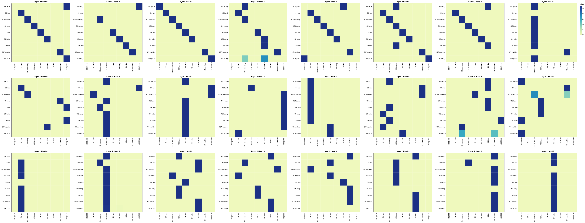
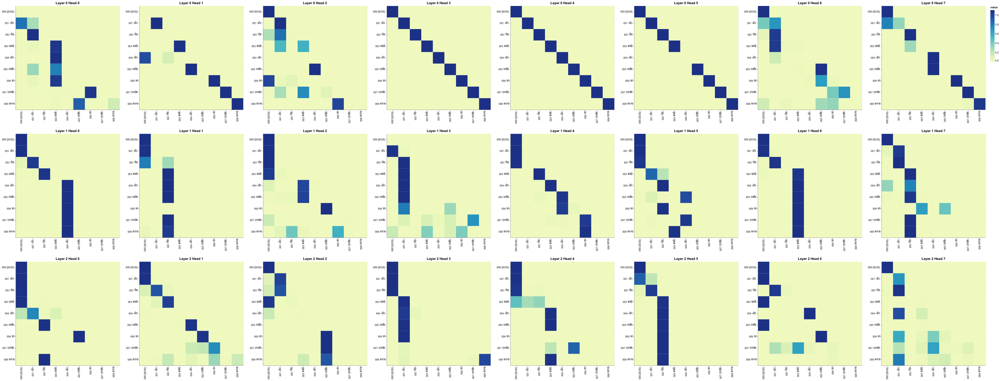
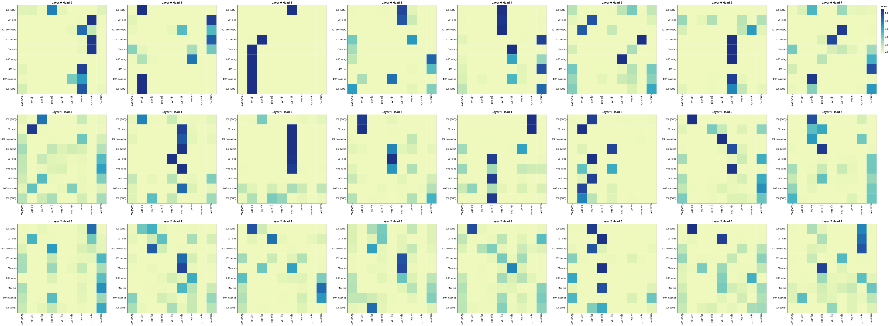
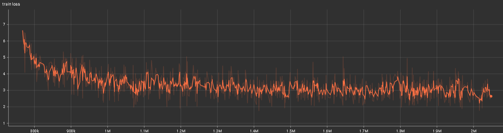

---

# 🚀 Transformer Model from Scratch 🚀

Welcome to the Transformer Model Pytorch repository! This project showcases a custom implementation of the Transformer architecture using PyTorch. Dive into sequence-to-sequence learning with one of the most influential models in natural language processing.

## 🌐 Overview

The Transformer model unveiled in the revolutionary paper ["Attention is All You Need"](https://arxiv.org/abs/1706.03762) by Vaswani et al., has transformed the landscape of NLP. Ditching traditional recurrent architectures, it relies on powerful self-attention mechanisms to excel in various tasks. This repository focuses on utilizing the Transformer for English to Hindi translation, demonstrating its prowess in handling complex linguistic structures across different languages. Dive into the core of Transformer architecture, exploring its encoder-decoder framework and how it processes language pairs effectively.

## 🎉 Features

- **🔥 Pure PyTorch Implementation:** Delve deep into the Transformer's intricacies with a from-scratch implementation that lets you explore every layer, every neuron.
- **🛠️ Modular Design:** Tinker with key components like multi-head self-attention and positional encoding. Our design lets you adapt and expand parts effortlessly.
- **📊 Comprehensive Training and Evaluation Scripts:** Jump right into training with pre-written scripts, making it easy to start translating between English and Hindi or assess your model’s performance.
- **👁️ Visualization Tools:** Get a graphical view of what's happening under the hood. Our tools let you watch the attention mechanisms at work and monitor training progress in real-time.
- **🌍 Bilingual Tokenization Support:** Tailored for the nuances of English and Hindi, ensuring accurate and effective handling of linguistic elements unique to both languages.

## 📋 Prerequisites

Before you begin, ensure you have the following installed:

- Python 3.7 or higher
- PyTorch 1.8.0 or higher
- NumPy
- Matplotlib (optional, for visualization)
- Altair (for advanced visualizations)

## 🔧 Installation

1. **Clone the repository:**

   ```bash
   git clone https://github.com/yourusername/transformer-from-scratch.git
   cd transformer-from-scratch
   ```

2. **Create a virtual environment and activate it:**

   ```bash
   python -m venv venv
   source venv/bin/activate  # On Windows, use `venv\Scripts\activate`
   ```

3. **Install the required packages:**

   ```bash
   pip install -r requirements.txt
   ```

## 🏗️ Model Architecture

Our Transformer model includes the following key components:

1. **🔤 Input Embeddings**: These transform token indices into dense vectors, facilitating the model's understanding of textual input.

2. **📍 Positional Encoding**: By imbuing embeddings with positional information, this component ensures the model comprehends the sequential order of tokens within the input.

3. **🎭 Multi-Head Self-Attention**: Enabling nuanced focus across diverse segments of the input sequence, this mechanism enhances the model's ability to discern context.

4. **💥 Feed-Forward Neural Network**: Infusing the model with non-linearity and intricacy, this network contributes to its capacity for sophisticated computations.

5. **🔁 Encoder and Decoder Layers**: Constituting stacks of attention and feed-forward layers, these elements play a pivotal role in constructing intricate representations of input data.

6. **🎯 Output Linear Layer**: Responsible for the final stage of transformation, this layer maps the decoder's output to match the size of the target vocabulary, ensuring alignment with desired linguistic outcomes.

### 📊 Visualization

To better understand the model's inner workings, use our visualization tools to inspect attention weights and training metrics.

#### Encoder Self-Attention

Visualize the self-attention mechanisms in the encoder layers:



#### Decoder Self-Attention

Visualize the self-attention mechanisms in the decoder layers:



#### Encoder-Decoder Attention

Visualize the attention mechanisms between the encoder and decoder layers:



- **Training Loss**:



## 🙏 Acknowledgments

This project draws inspiration from the original Transformer paper and various open-source implementations. We thank the PyTorch community for their comprehensive resources and tutorials.

## 📜 License

This project is licensed under the MIT License. See the [LICENSE](https://github.com/KaranAnchan/Transformers_Pytorch/blob/main/LICENSE) file for more details.

---
